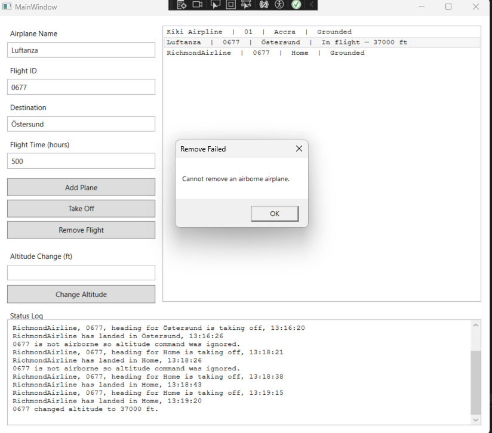

# ControlTower — Airport Simulator

Assignment 4 | Programming in C# II | Malmö University

## Overview
A WPF desktop application simulating a simplified airport flight departure system.
The Control Tower registers airplanes, authorises take-offs, monitors flights,
and receives landing notifications  all implemented using the
Publisher/Subscriber pattern with delegates and events.

## Screenshot


## How It Works
- Add a flight by filling in the name, flight ID, destination, and flight time
- Select a flight from the list and click **Take Off** to authorise departure
- The airplane simulates flight duration using a timer (1 second = 1 flight hour)
- The airplane automatically notifies the Control Tower when it has landed
- Select an airborne flight and use **Change Altitude** to issue an altitude command
- Grounded flights can be removed from the list using **Remove Flight**

## Key Concepts Implemented
- **Publisher/Subscriber pattern** — Airplane publishes events, ControlTower subscribes and re-publishes to MainWindow
- **Event delegates** — `TakeOff` and `Landed` events using `EventHandler<AirplaneEventArgs>`
- **Regular delegate** — `Func<int, int>` for altitude change commands (returns new altitude)
- **Unsubscribe/Resubscribe** — `-=` on landing, `+=` on next departure to prevent duplicate handlers
- **Separation of concerns** — Airplane handles flight logic, ControlTower manages traffic, MainWindow handles UI only

## Project Structure
```
ControlTower/
├── Models/
│   └── Airplane.cs
├── EventArgs/
│   ├── AirplaneEventArgs.cs
│   └── FlightHeightEventArgs.cs
├── AirportControlTower.cs
├── MainWindow.xaml
└── MainWindow.xaml.cs
```

## Tech Stack
- C# / .NET 9
- WPF (Windows Presentation Foundation)
- Visual Studio 2022

